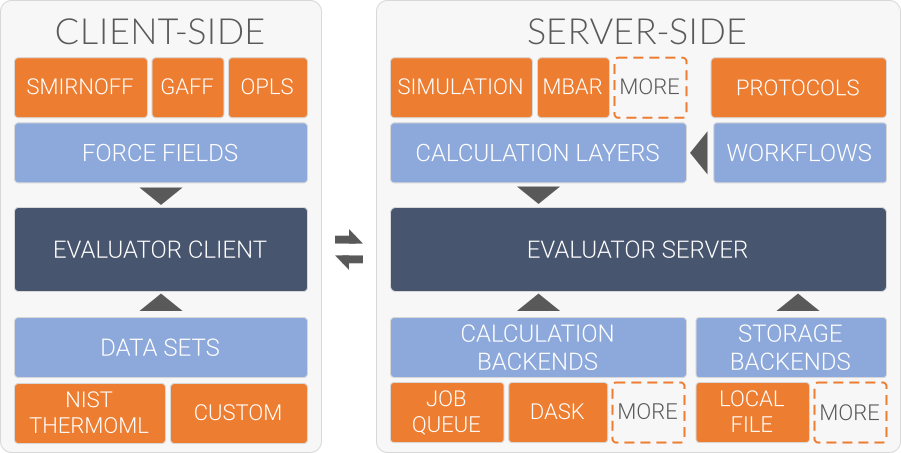

.. |evaluator_server|    replace:: :py:class:`~propertyestimator.server.EvaluatorServer`
.. |evaluator_client|    replace:: :py:class:`~propertyestimator.client.EvaluatorClient`

Architecture
============

The evaluator framework is constructed as a collection of modular components, each performing a specific role within the
estimation of physical property data sets. These components are designed to be as extensible as possible, with support
for user created plug-ins built into their core.

    An overview of the evaluators modular design. The framework is split into a 'client-side' which handles the
    curation and preparation of data sets, and a 'server-side' which performs the estimation of the data sets.

The framework is implemented as a *client-server* architecture. This design allows users to spin up |evaluator_server|
instances on whichever compute resources they may have available (from a single machine up to a large HPC cluster) to
which |evaluator_client| objects may connect to both request that data sets be estimated, and to query and retrieve the
results of those requests.

The *client-side* of the framework is predominantly responsible for providing APIs and objects for:

.. rst-class:: spaced-list

    * curating :doc:`data sets <../datasets/physicalproperties>` of physical properties from open data sources.
    * specifing custom :doc:`calculation schemas <../layers/calculationlayers>` which describe how individual properties
      should be computed.
    * requesting that data sets be estimated by a running |evaluator_server| instance.
    * retrieving the results of estimation requests from a running |evaluator_server| instance.

while the *server-side* is responsible for:

.. rst-class:: spaced-list

    * receiving estimation requests from an |evaluator_client| object.
    * automatically determining which :doc:`calculation approach <../layers/calculationlayers>` to use for each property
      in the request.
    * executing those requests across the available :doc:`compute resources <../backends/calculationbackend>` following
      the calculation schemas provided by the client
    * :doc:`caching data <../storage/storagebackend>` from any calculations which may be useful for future calculations.
