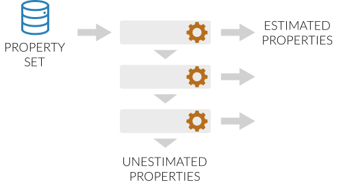

.. |calculation_layer_result|    replace:: :py:class:`~evaluator.layers.CalculationLayerResult`
.. |calculation_layer|           replace:: :py:class:`~evaluator.layers.CalculationLayer`
.. |calculation_layer_schema|    replace:: :py:class:`~evaluator.layers.CalculationLayerSchema`
.. |layer_decorator|             replace:: :py:meth:`~evaluator.layers.calculation_layer`

.. |evaluator_exception|         replace:: :py:class:`~evaluator.utils.exceptions.EvaluatorException`
.. |undefined|                   replace:: :py:class:`~evaluator.attributes.UNDEFINED`

.. |batch|                       replace:: :py:class:`~evaluator.server.Batch`

.. |_schedule_calculation|       replace:: :py:meth:`~evaluator.layers.CalculationLayer._schedule_calculation`

.. |register_calculation_schema|       replace:: :py:meth:`~evaluator.layers.register_calculation_schema`
.. |registered_calculation_schemas|    replace:: :py:attr:`~evaluator.layers.registered_calculation_schemas`

Calculation Layers
==================

A |calculation_layer| is an implementation of one calculation approach for estimating a set of physical properties,
such as via molecular simulation or evaluating some `QSAR <https://en.wikipedia.org/wiki/Quantitative_structure-
activity_relationship>`_ like model.

The framework stacks multiple layers together when estimating a data set of properties.

    A schematic of the layer system. A set of properties to estimate are fed into the first layer. Those which can
    be calculated are returned back. Those that can't are passed to the next layer until no layer are left.

Each layer will in turn attempt to evaluate the properties being estimated using the specific approach the layer
represents, such as by running a set of simulations. If the layer is unable to estimate a given property, for example
if a layer does not yet support a given property, or if the layer has insufficient data to reprocesses, the property
will be passed to the next layer for it to try and evaluate.

In practice, this allows the framework to attempt to estimate a data set using the most rapid calculation layer first,
before moving to successively slower yet more robust layers, and thus enabling as efficient as possible property
estimation.

Defining a Calculation Layer
----------------------------

A calculation layer is defined by two objects - a |calculation_layer| object which implements the main layer
logic, and a |calculation_layer_schema| which defines those settings and options exposed required by the layer.

One |calculation_layer_schema| will be provided to the for each type of property that the layer is being asked to
estimate. The base |calculation_layer_schema| currently only exposes options for optionally defining either the
relative or absolute uncertainty that the layer should attempt to estimate the associated property type to within,
however custom schemas can be defined per layer.

The structure of a |calculation_layer| is relatively simple and permissive::

    @calculation_layer()
    class MyCalculationLayer(CalculationLayer):

        @classmethod
        def required_schema_type(cls):
            return CalculationLayerSchema

        @classmethod
        def _schedule_calculation(
            cls,
            calculation_backend,
            storage_backend,
            layer_directory,
            batch
        ):
            ...

The first thing to note is the |layer_decorator| decorator which is being applied to the class. This registers
the calculation layer with the frameworks plug-in system, allowing it to be used in future calculations.

The only other requirements is that the class implement a ``required_schema_type`` class method, which returns the
type of |calculation_layer_schema| that is associated with this layer, and a |_schedule_calculation|. The
|_schedule_calculation| is responsible for performing the actual property calculations.

The form of the |_schedule_calculation| function is very flexible::

    @classmethod
    def _schedule_calculation(
        cls,
        calculation_backend,
        storage_backend,
        layer_directory,
        batch
    ):

        futures = []

        for queued_property in batch.queued_properties:

            futures.append(
                calculation_backend.submit_task(
                    cls.process_property, queued_property, cls.__name__
                )
            )

        return futures

It takes as arguments:

.. rst-class:: spaced-list

    * a :doc:`CalculationBackend <../backends/calculationbackend>` which is used to asynchronously distribute any
      calculations across the available compute resources.
    * a :doc:`StorageBackend <../storage/storagebackend>` which may be used to store / cache any data generated by the
      calculations.
    * the path to the directory within which all of the calculation working files should be stored.
    * the |batch| of properties which this layer should attempt to estimate. This object includes the properties
      to estimate, as well as the |calculation_layer_schema| for each property type.

and must return a list of ``Future`` objects (which either must be or implement the same API as the `asyncio
Future object <https://docs.python.org/3/library/asyncio-future.html>`_). The easiest way to generate the futures
is to perform any calculations using the ``calculation_backend`` which will automatically return the
results of any functions as such.

The future objects returned by |_schedule_calculation| must return a |calculation_layer_result| object, which
includes

.. rst-class:: spaced-list

    * the estimated property if the calculation was successful (or |undefined| otherwise).
    * a list of any exceptions (of type |evaluator_exception|) which were raised during the calculation.
    * a list of any data to be stored by the storage backend.

As a minimal example of a method which returns one such object::

    @classmethod
    def process_property(cls, physical_property, **_):
        """Return a result as if the property had been successfully estimated.
        """

        # TODO: Do some calculations

        # Set the property provenance
        physical_property.source = CalculationSource(fidelity=cls.__name__)

        # Return the results object.
        results = CalculationLayerResult()
        results.physical_property = physical_property
        return results

Default Schemas
---------------

Default schemas for each pair of a calculation layer and a type of physical property may be registered using the
|register_calculation_schema| function::

    # Register the default schema to use for density measurements being estimated
    # by the direct simulation calculation layer.
    register_calculation_schema(
        property_class=Density,
        layer_class=SimulationLayer,
        schema=Density.default_simulation_schema
    )

where the schema object should either be an instance of a |calculation_layer_schema|, or a function with no required
arguments which returns a |calculation_layer_schema|.

A list of the registered schemas is provided by the |registered_calculation_schemas| module attribute.