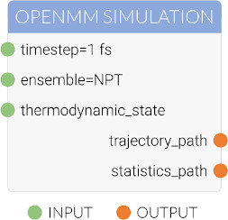

.. |protocol|           replace:: :py:class:`~propertyestimator.workflow.Protocol`
.. |protocol_schema|    replace:: :py:class:`~propertyestimator.workflow.schemas.ProtocolSchema`
.. |protocol_graph|     replace:: :py:class:`~propertyestimator.workflow.ProtocolGraph`
.. |protocol_path|      replace:: :py:class:`~propertyestimator.workflow.utils.ProtocolPath`
.. |workflow|           replace:: :py:class:`~propertyestimator.workflow.Workflow`
.. |workflow_schema|    replace:: :py:class:`~propertyestimator.workflow.schemas.WorkflowSchema`
.. |workflow_graph|     replace:: :py:class:`~propertyestimator.workflow.WorkflowGraph`
.. |workflow_result|    replace:: :py:class:`~propertyestimator.workflow.WorkflowResult`

Protocols
=========

The |protocol| class represents a task to be executed within some larger workflow. The task encoded by a protocol
may be as simple as adding two numbers together or even as complex as performing entire free energy simulations. In
general however a protocol should have a *single* well defined task to perform.

Protocols