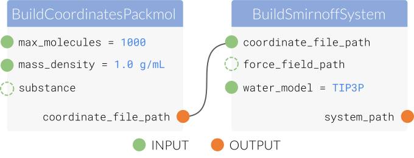

.. |protocol|           replace:: :py:class:`~propertyestimator.workflow.Protocol`
.. |protocol_schema|    replace:: :py:class:`~propertyestimator.workflow.schemas.ProtocolSchema`
.. |protocol_graph|     replace:: :py:class:`~propertyestimator.workflow.ProtocolGraph`
.. |protocol_path|      replace:: :py:class:`~propertyestimator.workflow.utils.ProtocolPath`
.. |workflow|           replace:: :py:class:`~propertyestimator.workflow.Workflow`
.. |workflow_schema|    replace:: :py:class:`~propertyestimator.workflow.schemas.WorkflowSchema`
.. |workflow_graph|     replace:: :py:class:`~propertyestimator.workflow.WorkflowGraph`
.. |workflow_result|    replace:: :py:class:`~propertyestimator.workflow.WorkflowResult`

.. |generate_default_metadata|    replace:: :py:meth:`~propertyestimator.workflow.Workflow.generate_default_metadata`

.. |substance|                    replace:: :py:class:`~propertyestimator.substances.Substance`
.. |thermodynamic_state|          replace:: :py:class:`~propertyestimator.thermodynamics.ThermodynamicState`

.. |parameter_gradient_key|       replace:: :py:class:`~propertyestimator.forcefield.ParameterGradientKey`

.. |build_coordinates_packmol|    replace:: :py:class:`~propertyestimator.protocols.coordinates.BuildCoordinatesPackmol`
.. |build_smirnoff_system|        replace:: :py:class:`~propertyestimator.protocols.forcefield.BuildSmirnoffSystem`

.. |protocol_schemas|             replace:: :py:class:`~propertyestimator.workflow.schemas.WorkflowSchema.protocol_schemas`
.. |final_value_source|           replace:: :py:class:`~propertyestimator.workflow.schemas.WorkflowSchema.final_value_source`
.. |gradients_sources|            replace:: :py:class:`~propertyestimator.workflow.schemas.WorkflowSchema.gradients_sources`
.. |outputs_to_store|             replace:: :py:class:`~propertyestimator.workflow.schemas.WorkflowSchema.outputs_to_store`
.. |protocol_replicators|         replace:: :py:class:`~propertyestimator.workflow.schemas.WorkflowSchema.protocol_replicators`

Workflows
=========

The framework offers a lightweight workflow engine for executing graphs of tasks using the available :doc:`calculation
backends <calculationbackend>`. While lightweight, it offers a large amount of extensibility and flexibility, and is
currently used by both the :doc:`simulation <simulationlayer>` and :doc:`reweighting <reweightinglayer>` layers to
perform their required calculations.

All workflows to be executed are created from a |workflow_schema|. The schema defines a blueprint for a particular
workflow (for example, a workflow to calculate a density from molecular simulation) and includes:

.. rst-class:: spaced-list

    - |protocol_schemas|: The schemas of the :doc:`protocols <protocols>` which compose the workflow.

as well as optionally:

.. rst-class:: spaced-list

    - |final_value_source|: A reference to the protocol output which corresponds to the value of the
      observable calculated by the workflow.
    - |gradients_sources|: A list of references to the protocol outputs which correspond to the gradients of the
      calculated observable with respect to a specified set of force field parameters.
    - |outputs_to_store|: A list of :doc:`data classes <dataclasses>` which will be generated by the workflow.
    - |protocol_replicators|: A set of :ref:`replicators <Replicators>` which flag parts of a workflow which should be
      replicated.

A workflow to execute is represented by the |workflow| object, whereby a workflow is created from both it's schema
as well as a dictionary of metadata which will be made available to the workflow.

Connecting Protocols
--------------------

Workflows are constructed by chaining together multiple protocols by setting the inputs of certain protocols as the
outputs of others. This is accomplished using the |protocol_path| object.

A |protocol_path| is a reference to the output of a protocol in a workflow. It is created from two parts:

* the name of the output attribute to reference (passed as the ``property_name`` constructor argument).
* the unique id of the protocol to take the output from.

    A schematic view of a |build_smirnoff_system| protocol which takes inputs from a |build_coordinates_packmol|
    protocol.

As an example, consider the case whereby a |build_smirnoff_system| protocol takes it's coordinate file
input from the output of a |build_coordinates_packmol| protocol::

    # Set up the protocol which will build some coordinates for a system.
    build_coordinates = BuildCoordinatesPackmol("build_coordinates")
    build_coordinates.max_molecules = 1000
    build_coordinates.mass_density = 1.0 * unit.gram / unit.millilitre

    # Set up the protocol which will assign force field parameters to the system.
    assign_parameters = BuildSmirnoffSystem(f"assign_parameters{id_suffix}")
    assign_parameters.water_model = BuildSmirnoffSystem.WaterModel.TIP3P

    # Instruct the `assign_parameters` protocol to take its `coordinate_file_path`
    # from the `coordinate_file_path` output of the `build_coordinates` protocol
    assign_parameters.coordinate_file_path = ProtocolPath(
        "coordinate_file_path", build_coordinates.id
    )

The workflow engine will automatically replace the protocol path with the actual value it references once the
referenced protocol (in this case ``build_coordinates``) has finished executing.

The workflow engine will automatically determine the order in which to execute protocols such that all the input
dependencies are satisfied.

Global Metadata
###############

Each workflow makes available a set of *global metadata* which can be used as inputs to each of the component protocols.

The available metadata is specified when creating the |workflow| object through the ``global_metadata`` argument. It
should be a dictionary where the keys correspond to the metadata keys and the values can be any JSON serializable
structures::

    # Define the metadata dictionary.
    metadata = {
        "some_int_data": 1,
        "some_list_data": [1, 2, 3]
    }

    # Pass the metadata to the workflow.
    workflow = Workflow(global_metadata=metadata)

The metadata is then accessible using a |protocol_path| with a protocol name of ``global``::

    # The metadata is then accessible via ProtocolPath objects
    ProtocolPath("some_int_data", "global")
    ProtocolPath("some_list_data", "global")

By default (see the :doc:`simulation <simulationlayer>` and :doc:`reweighting <reweightinglayer>` layer documentation)
this *metadata* is populated from the property which the workflow is aiming to estimate using the
|generate_default_metadata| function, and includes:

.. table::
   :widths: auto
   :align: center
   :class: clean-table

   +--------------------------------+-----------------------------------+------------------------------------------------------------------------------------------------------+
   || Key                           || Type                             || Description                                                                                         |
   +================================+===================================+======================================================================================================+
   || ``thermodynamic_state``       || |thermodynamic_state|            || The state at which the to perform any calculations .                                                |
   +--------------------------------+-----------------------------------+------------------------------------------------------------------------------------------------------+
   || ``substance``                 || |substance|                      || The substance to use in any calculations.                                                           |
   +--------------------------------+-----------------------------------+------------------------------------------------------------------------------------------------------+
   || ``components``                || list of |substance|              || The components present in the main ``substance``.                                                   |
   +--------------------------------+-----------------------------------+------------------------------------------------------------------------------------------------------+
   || ``target_uncertainty``        || ``pint.Quantity``                || The target uncertainty of any calculations.                                                         |
   +--------------------------------+-----------------------------------+------------------------------------------------------------------------------------------------------+
   || ``per_component_uncertainty`` || ``pint.Quantity``                || The ``target_uncertainty`` divided by the sqrt of the number of components in the ``substance`` + 1 |
   +--------------------------------+-----------------------------------+------------------------------------------------------------------------------------------------------+
   || ``force_field_path``          || ``str``                          || A file path to the force field parameters to used in any calculations.                              |
   +--------------------------------+-----------------------------------+------------------------------------------------------------------------------------------------------+
   || ``parameter_gradient_keys``   || list of |parameter_gradient_key| || The parameters to differentiate any observables with respect to.                                    |
   +--------------------------------+-----------------------------------+------------------------------------------------------------------------------------------------------+

Replicators
-----------

There are times whereby

Protocol Replacements
---------------------
