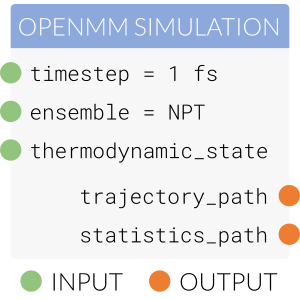

.. |protocol|                     replace:: :py:class:`~propertyestimator.workflow.Protocol`
.. |protocol_schema|              replace:: :py:class:`~propertyestimator.workflow.schemas.ProtocolSchema`

.. |input_attribute|              replace:: :py:class:`~propertyestimator.workflow.attributes.InputAttribute`
.. |output_attribute|             replace:: :py:class:`~propertyestimator.workflow.attributes.OutputAttribute`
.. |undefined|                    replace:: :py:class:`~propertyestimator.attributes.UNDEFINED`
.. |inequality_merge_behavior|    replace:: :py:class:`~propertyestimator.workflow.attributes.InequalityMergeBehaviour`

.. |openmm_simulation|    replace:: :py:class:`~propertyestimator.protocols.openmm.OpenMMSimulation`

.. |compute_resources|    replace:: :py:class:`~propertyestimator.backends.ComputeResources`

.. |can_merge|            replace:: :py:meth:`~propertyestimator.workflow.Protocol.can_merge`
.. |_execute|              replace:: :py:meth:`~propertyestimator.workflow.Protocol._execute`
.. |execute|              replace:: :py:meth:`~propertyestimator.workflow.Protocol.execute`
.. |merge|                replace:: :py:meth:`~propertyestimator.workflow.Protocol.merge`
.. |validate|             replace:: :py:meth:`~propertyestimator.workflow.Protocol.execute`

.. |to_protocol|          replace:: :py:meth:`~propertyestimator.workflow.schemas.ProtocolSchema.to_protocol`

.. |schema|               replace:: :py:attr:`~propertyestimator.workflow.Protocol.schema`

Protocols
=========

The |protocol| class represents a single task to be executed, whether that be as a standalone task or as a task which is
part of some larger workflow. The task encoded by a protocol may be as simple as adding two numbers together or even
as complex as performing entire free energy simulations::

    from propertyestimator.protocols.miscellaneous import AddValues

    # Create the protocol and assign it some unique name.
    add_numbers = AddValues(protocol_id="add_values")
    # Set the numbers to add together
    add_numbers.values = [1, 2, 3, 4]

    # Execute the protocol
    add_numbers.execute()

    # Retrieve the output
    result = add_numbers.result

Inputs and Outputs
------------------

Each protocol exposes a set of the required inputs as well as the produced outputs. These inputs may either be set as a
constant directly, or if used as part of a :doc:`workflow <workflows>`, can take their value from one of the outputs of
another protocol.

    A selection of the inputs and outputs of the |openmm_simulation| protocol.

A surprisingly rich spectrum of workflows can be constructed by chaining together many relatively simple protocols.

The inputs and outputs of a protocol are defined using the custom |input_attribute| and |output_attribute| descriptors::

    class AddValues(Protocol):

        # Define the inputs that the protocol requires
        values = InputAttribute(
            docstring="The values to add together.",
            type_hint=list, default_value=UNDEFINED
        )

        # Define the outputs that the protocol will produce
        # once it is executed.
        result = OutputAttribute(
            docstring="The sum of the values.",
            type_hint=typing.Union[int, float, pint.Measurement, pint.Quantity],
        )

        def _execute(self, directory, available_resources):
            ...

        def validate(self, attribute_type=None):
            ...

Here we have defined a ``values`` input to the protocol and a ``result`` output. Both descriptors require a
``docstring`` and a ``type_hint`` to be provided.

The ``type_hint`` will be used by the workflow engine to ensure that a protocol which takes its input as the output of
another protocol is receiving values of the correct type. Currently the ``type_hint`` can be any type of python class,
or a ``Union`` of multiple types should the protocol allow for that.

In addition, the input attribute must specify a ``default_value`` for the attribute. This can either be a constant
value, or a value set by some function such as a ``lambda`` statement::

    some_input = InputAttribute(
        docstring="Takes it's default value from a function.",
        type_hint=int,
        default_value=lambda: return 1 + 1
    )

In the above example we set the default value of ``values`` to |undefined| in order to specify that this input must be
set by the user. The custom |undefined| class is used in place of ``None`` as ``None`` may be a valid input value for
some attributes.

Task Execution
--------------

In addition to defining its inputs and outputs, a protocol must also implement an |_execute| function which handles
the main logic of the task::

    def _execute(self, directory, available_resources):

        self.result = self.values[0]

        for value in self.values[1:]:
            self.result += value

The function is passed the directory in which it should run and create any working files, as well as a
|compute_resources| object which describes which compute resources are available to run on. This function *must* set all
of the output attributes of the protocol before returning.

The private |_execute| function which must be implemented should not be confused with the public |execute| function.
The public |execute| function implements some common protocol logic (such as validating the inputs and creating the
directory to run in if needed) before calling the private |_execute| function.

Protocol Validation
-------------------

The protocols inputs will automatically be validated before |_execute| is called - this validation includes making
sure that all of the non-optional inputs have been set, as well as ensuring they have been set to a value of the correct
type. Protocols may implement additional validation logic by implementing a |validate| function::

    def validate(self, attribute_type=None):

        super(AddValues, self).validate(attribute_type)

        if len(self.values) < 1:
            raise ValueError("There were no values to add together")

Schemas
-------

Every protocol has a |protocol_schema| representation which uniquely describes the protocol, and from which the protocol
can be exactly recreated. The schema stores not only the type of protocol which it represents, but also the values of
each of the inputs. Protocol schemas are fully JSON serializable. The following is an example schema for the above
``add_numbers`` protocol:

.. code-block:: json

    {
      "@type": "propertyestimator.workflow.schemas.ProtocolSchema",
      "id": "add_values",
      "inputs": {
        ".allow_merging": true,
        ".values": [1, 2, 3, 4]
      },
      "type": "AddValues"
    }

A protocols schema can be accessed via it's |schema| attribute. A protocol can be directly created from its schema
representation by calling the schema's |to_protocol| function.

Merging Protocols
-----------------

When executing multiple workflows together (e.g. executing a workflow to estimate a substances density and potential
energy) there is a large likelihood that some of tasks in those two workflows will be identical. Examples may include
two workflows requiring protocols which build a set of coordinates, or assigning the same set of parameters to those
coordinates.

Protocols have built-in support for comparing whether they are performing the same task / calculation as another
protocol through the |can_merge| and |merge| functions:

.. rst-class:: spaced-list

    * The |can_merge| function checks to see whether two protocols are performing an identical task and hence whether
      they should be merged or not.

    * The |merge| function handles the actual merging of two protocols which can be merged.

The default |can_merge| function takes advantage of the ``merge_behvaiour`` attribute of the different input
descriptors. The ``merge_behvaiour`` attribute describes how each input should be considered when checking to see
if two protocols can be merged::

    max_molecules = InputAttribute(
        docstring="The maximum number of molecules to be added to the system.",
        type_hint=int,
        default_value=1000,
        merge_behavior=MergeBehaviour.ExactlyEqual
    )

The most common behavior is to require that the inputs must be ``ExactlyEqual`` in order for two protocols two be
considered to be identical. However, for some inputs such as the timestep of a simulation or the number of steps to
simulate for, the exact values of the inputs don't necessarily need to be equal but rather, we may
just wish to take the larger / smaller of the two inputs::

    timestep = InputAttribute(
        docstring="The timestep to evolve the system by at each step.",
        type_hint=pint.Quantity,
        merge_behavior=InequalityMergeBehaviour.SmallestValue,
        default_value=2.0 * unit.femtosecond,
    )

    total_number_of_iterations = InputAttribute(
        docstring="The number of times to propogate the system forward by.",
        type_hint=int,
        merge_behavior=InequalityMergeBehaviour.LargestValue,
        default_value=1,
    )

This can be accomplished using the |inequality_merge_behavior| enum.

The default |merge| function also relies upon the ``merge_behaviour`` attributes to determine which values of the
inputs should be retained when merging two protocols.