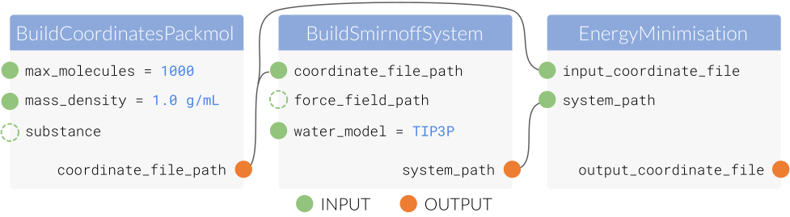

.. |protocol|           replace:: :py:class:`~evaluator.workflow.Protocol`
.. |protocol_schema|    replace:: :py:class:`~evaluator.workflow.schemas.ProtocolSchema`
.. |protocol_graph|     replace:: :py:class:`~evaluator.workflow.ProtocolGraph`
.. |protocol_path|      replace:: :py:class:`~evaluator.workflow.utils.ProtocolPath`
.. |workflow|           replace:: :py:class:`~evaluator.workflow.Workflow`
.. |workflow_schema|    replace:: :py:class:`~evaluator.workflow.schemas.WorkflowSchema`
.. |workflow_graph|     replace:: :py:class:`~evaluator.workflow.WorkflowGraph`
.. |workflow_result|    replace:: :py:class:`~evaluator.workflow.WorkflowResult`

.. |generate_default_metadata|    replace:: :py:meth:`~evaluator.workflow.Workflow.generate_default_metadata`

.. |build_coordinates_packmol|    replace:: :py:class:`~evaluator.protocols.coordinates.BuildCoordinatesPackmol`
.. |build_smirnoff_system|        replace:: :py:class:`~evaluator.protocols.forcefield.BuildSmirnoffSystem`

.. |protocol_schemas|             replace:: :py:attr:`~evaluator.workflow.schemas.WorkflowSchema.protocol_schemas`
.. |final_value_source|           replace:: :py:attr:`~evaluator.workflow.schemas.WorkflowSchema.final_value_source`
.. |gradients_sources|            replace:: :py:attr:`~evaluator.workflow.schemas.WorkflowSchema.gradients_sources`
.. |outputs_to_store|             replace:: :py:attr:`~evaluator.workflow.schemas.WorkflowSchema.outputs_to_store`
.. |protocol_replicators|         replace:: :py:attr:`~evaluator.workflow.schemas.WorkflowSchema.protocol_replicators`

.. |result_value|                 replace:: :py:attr:`~evaluator.workflow.WorkflowResult.value`
.. |result_gradients|             replace:: :py:attr:`~evaluator.workflow.WorkflowResult.gradients`
.. |result_data_to_store|         replace:: :py:attr:`~evaluator.workflow.WorkflowResult.data_to_store`

.. |property_name|                replace:: :py:attr:`~evaluator.workflow.utils.ProtocolPath.property_name`

.. |protocol_replicator|          replace:: :py:class:`~evaluator.workflow.schemas.ProtocolReplicator`
.. |replicator_value|             replace:: :py:class:`~evaluator.workflow.utils.ReplicatorValue`

Workflows
=========

The framework offers a lightweight workflow engine for executing graphs of tasks using the available :doc:`calculation
backends <../backends/calculationbackend>`. While lightweight, it offers a large amount of extensibility and flexibility,
and is currently used by both the :doc:`simulation <../layers/simulationlayer>` and :doc:`reweighting
<../layers/reweightinglayer>` layers to perform their required calculations.

A workflow is a wrapper around a collection of tasks that should be executed in succession, and whose outputs should be
made available as the input to others.

    A an example workflow which combines a protocol which will build a set of coordinates for a particular system,
    assign parameters to that system, and then perform an energy minimisation.

The workflow engine offers a number of advanced features such as the :doc:`automatic reduction of redundant tasks
<workflowgraphs>`, and :doc:`looping over parts of a workflow <replicators>`

Building Workflows
------------------

At its core a workflow must define the tasks which need to be executed, and where the inputs to those tasks should be
sourced from. Each task to be executed is represented by a :doc:`protocol object <protocols>`, with each
protocol requiring a specific set of user specified inputs::

    # Define a protocol which will build some coordinates for a system.
    build_coordinates = BuildCoordinatesPackmol("build_coordinates")
    build_coordinates.max_molecules = 1000
    build_coordinates.mass_density = 1.0 * unit.gram / unit.millilitre
    build_coordinates.substance = Substance.from_components("O", "CO")

    # Define a protocol which will assign force field parameters to the system.
    assign_parameters = BuildSmirnoffSystem(f"assign_parameters")
    assign_parameters.water_model = BuildSmirnoffSystem.WaterModel.TIP3P
    assign_parameters.force_field_path = "openff-1.0.0.offxml"

    # Set the `coordinate_file_path` input of the `assign_parameters` protocol
    # to the `coordinate_file_path` output of the `build_coordinates` protocol.
    assign_parameters.coordinate_file_path = ProtocolPath(
        "coordinate_file_path", build_coordinates.id
    )

The |protocol_path| object is used to reference the output of another protocol in the workflow, and will be replaced by
the value of that output once that protocol has been executed by the workflow engine. It is constructed from two parts:

* the name of the output attribute to reference.
* the unique id of the protocol to take the output from.

To turn these tasks into a valid workflow which can be automatically executed, they must first be converted to a
:ref:`workflow schema <workflows/workflows:Workflow Schemas>`::

    # Create the schema object.
    schema = WorkflowSchema()
    # Add the individual protocol's schema representations to the workflow schema.
    schema.protocol_schemas = [build_coordinates.schema, assign_parameters.schema]

    # Create the executable workflow object from its schema.
    workflow = Workflow.from_schema(schema, metadata=None)

A |workflow| may either be synchronously executed in place yielding a |workflow_result| object directly::

    workflow_result = workflow.execute()

or asynchronously using a calculation backend yielding a ``Future`` like object which will eventually return a
|workflow_result|::

    with DaskLocalCluster() as calculation_backend:
        result_future = workflow.execute(calculation_backend=calculation_backend)

In addition, a workflow may be add to, and executed as part as a larger :doc:`workflow graphs
<workflowgraphs>`.

Workflow Schemas
----------------

A |workflow_schema| is a blueprint from which all |workflow| objects are constructed. It will predominantly define the
tasks which compose the workflow, but may optionally define:

.. rst-class:: spaced-list

    - |final_value_source|: A reference to the protocol output which corresponds to the value of the
      main observable calculated by the workflow.
    - |gradients_sources|: A list of references to the protocol outputs which correspond to the gradients of the
      main observable with respect to a set of force field parameters.
    - |outputs_to_store|: A list of :doc:`data classes <../storage/dataclasses>` whose values will be populated from
      protocol outputs.
    - |protocol_replicators|: A set of :doc:`replicators <replicators>` which are used to flag parts of a
      workflow which should be replicated.

Each of these attributes will control whether the |result_value|, |result_gradients| and |result_data_to_store|
attributes of the |workflow_result| results object will be populated respectively when executing a workflow.

Metadata
""""""""

Because a schema is purely a blueprint for a general workflow, it need not define the exact values of all of the inputs
of its constituent tasks. Consider the above example workflow for constructing a set of coordinates and assigning force
field parameters to them. Ideally this one schema could be reused for multiple substances. This is made possible through
a workflows *metadata*.

Each protocol within a workflow may access a dictionary of values unique to that workflow (termed here *metadata*) which
is defined when the |workflow| object is created from its schema.

This metadata may be accessed by protocols via a fictitious ``"global"`` protocol whose outputs map to the ``metadata``
dictionary::

    build_coordinates = BuildCoordinatesPackmol("build_coordinates")
    build_coordinates.substance = ProtocolPath("substance", "global")

    # ...

    substances = [
        Substance.from_components("CO"),
        Substance.from_components("CCO"),
        Substance.from_components("CCCO"),
    ]

    for substance in substances:

        # Define the metadata to make available to the workflow protocols.
        metadata = {"substance": substance}
        # Create the executable workflow object from its schema.
        workflow = Workflow.from_schema(schema, metadata=metadata)

        # Execute the workflow ...

the created workflow will contain the ``build_coordinates`` protocol but with its ``substance`` input set to the value
from the ``metadata`` dictionary.
